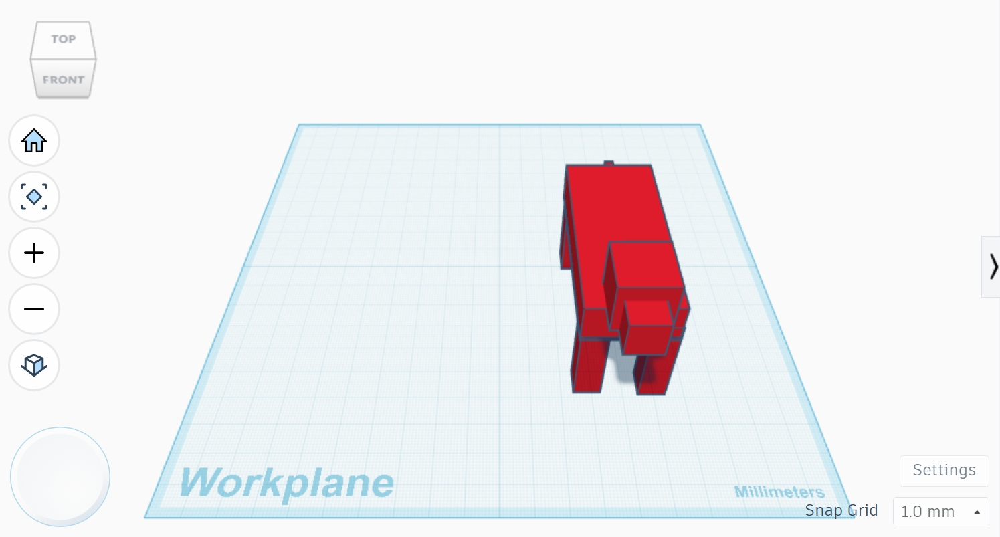
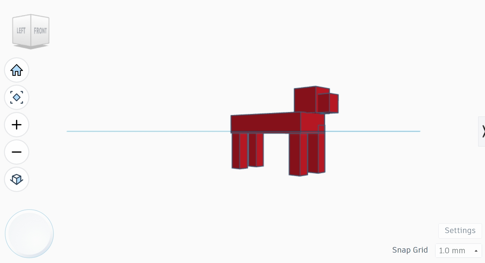
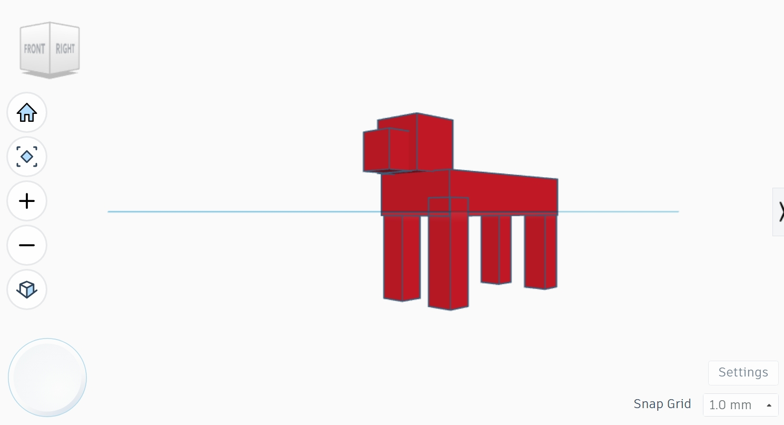

# Robot Dog Mechanical Design

## Overview
This project presents the first mechanical design of a simple robot dog created using Tinkercad.

## Project Files
- RobotDog.stl – 3D model of the robot dog.
- Front.jpeg – Front view.
- Left.jpeg – Left side view.
- Right.jpeg – Right side view.
- Perspective 1.jpeg – First perspective view.
- Perspective 2.jpeg – Second perspective view.

## Project Preview

### Front View

### Left View

### Right View

### Perspective View 1

### Perspective View 2

## Software Used
- Tinkercad

## Author
Feras Alzahrani
